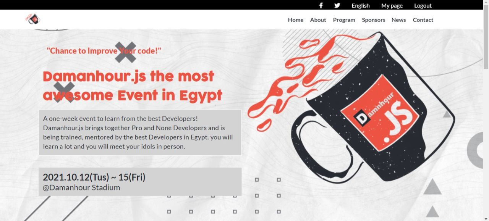

## My Capstone project

>  In this project, I will build a conference page with html, scss and javascript.

## To get a local copy up and running follow these simple example steps.
> Open the terminal
- Run git clonehttps://github.com/farouqdaif1/capstone1.git
- Then run git checkout Add-toolbar-and-headline
- Now you can open the index.html file in your browser

## Built With

- Major languages:Html , CSS and Java Script
- Technologies used :GIT and GitHup 

## To see the Project
click the link:https://farouqdaif1.github.io/capstone1/

## Authors

👤 **Author1**

- GitHub: [@farouqdaif1](https://github.com/farouqdaif1)
- Twitter: [@farouqdaif](https://twitter.com/farouqdaif)
- LinkedIn: [LinkedIn](https://www.linkedin.com/in/farouqdaif/https://www.linkedin.com/in/farouqdaif/)

## 🤝 Contributing

Contributions, issues, and feature requests are welcome!

Feel free to check the [issues page](../../issues/).

## Show your support

Give a ⭐️ if you like this project!
## 📝 License

This project is [MIT](./MIT.md) licensed.

